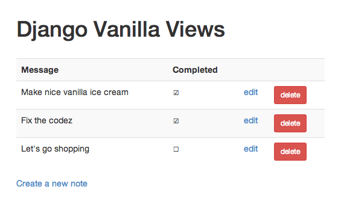

# Django Vanilla Views

**Beautifully simple class based views.**

**Author:** Tom Christie, [Follow me on Twitter][1].

    View --+------------------------- RedirectView
           |
           +-- GenericView -------+-- TemplateView
           |                      |
           |                      +-- FormView
           |
           +-- GenericModelView --+-- ListView
                                  |
                                  +-- DetailView
                                  |
                                  +-- CreateView
                                  |
                                  +-- UpdateView
                                  |
                                  +-- DeleteView

Django's generic class based view implementation is unneccesarily complicated.

Django vanilla views gives you the same benefits of using class based views, but with:

* No mixin classes.
* No calls to `super()`.
* A sane class heirarchy.
* A stripped down API.
* Simpler method implementations, with less magical behavior.

Note that the package does not yet include the date based generic views.

`django-vanilla-views` should currently be considered in draft.  A properly tested and documented beta release is planned.

**The release announcement and further details on `django-vanilla-views` are [available here](http://dabapps.com/blog/fixing-djangos-generic-class-based-views/).**

# Installation

Install using pip.

    pip install django-vanilla-views

# Usage

Import and use the views.

    from vanilla import ListView, DetailView

This repository includes an example project in the `'example'` directory.

To run the example, clone the repo, and then:

    cd example
    virtualenv env
    source env/bin/activate
    pip install -r requirements.txt
    python ./manage.py syncdb --noinput
    python ./manage.py runserver

**screenshot**

The project code is listed below as an example of using `django-vanilla-views`.

**views.py**

	from django.core.urlresolvers import reverse_lazy
	from example.notes.models import Note
	from vanilla import CreateView, DeleteView, ListView, UpdateView
	
	class ListNotes(ListView):
	    model = Note
	
	
	class CreateNote(CreateView):
	    model = Note
	    success_url = reverse_lazy('list_notes')
	
	
	class EditNote(UpdateView):
	    model = Note
	    success_url = reverse_lazy('list_notes')
	
	
	class DeleteNote(DeleteView):
	    model = Note
	    success_url = reverse_lazy('list_notes')
	
	
	list_notes = ListNotes.as_view()
	create_note = CreateNote.as_view()
	edit_note = EditNote.as_view()
	delete_note = DeleteNote.as_view()

**urls.py**

	from django.conf.urls import patterns, include, url
	from example.notes.models import Note
	
	urlpatterns = patterns('example.notes.views',
	    url(r'^$', 'list_notes', name='list_notes'),
	    url(r'^create/$', 'create_note', name='create_note'),
	    url(r'^edit/(?P<pk>\d+)/$', 'edit_note', name='edit_note'),
	    url(r'^delete/(?P<pk>\d+)/$', 'delete_note', name='delete_note'),
	)

# License

Copyright © Tom Christie.

All rights reserved.

Redistribution and use in source and binary forms, with or without 
modification, are permitted provided that the following conditions are met:

Redistributions of source code must retain the above copyright notice, this 
list of conditions and the following disclaimer.
Redistributions in binary form must reproduce the above copyright notice, this 
list of conditions and the following disclaimer in the documentation and/or 
other materials provided with the distribution.
THIS SOFTWARE IS PROVIDED BY THE COPYRIGHT HOLDERS AND CONTRIBUTORS "AS IS" AND 
ANY EXPRESS OR IMPLIED WARRANTIES, INCLUDING, BUT NOT LIMITED TO, THE IMPLIED 
WARRANTIES OF MERCHANTABILITY AND FITNESS FOR A PARTICULAR PURPOSE ARE 
DISCLAIMED. IN NO EVENT SHALL THE COPYRIGHT HOLDER OR CONTRIBUTORS BE LIABLE 
FOR ANY DIRECT, INDIRECT, INCIDENTAL, SPECIAL, EXEMPLARY, OR CONSEQUENTIAL 
DAMAGES (INCLUDING, BUT NOT LIMITED TO, PROCUREMENT OF SUBSTITUTE GOODS OR 
SERVICES; LOSS OF USE, DATA, OR PROFITS; OR BUSINESS INTERRUPTION) HOWEVER 
CAUSED AND ON ANY THEORY OF LIABILITY, WHETHER IN CONTRACT, STRICT LIABILITY, 
OR TORT (INCLUDING NEGLIGENCE OR OTHERWISE) ARISING IN ANY WAY OUT OF THE USE 
OF THIS SOFTWARE, EVEN IF ADVISED OF THE POSSIBILITY OF SUCH DAMAGE.

[1]: http://twitter.com/_tomchristie
